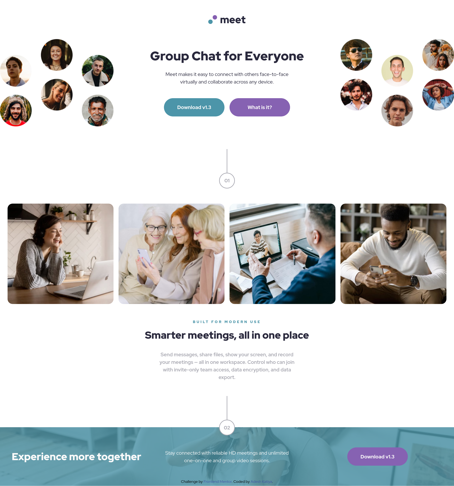

## Resources

1. youtube video for bg image:

# Frontend Mentor - Meet Landing Page solution

This is a solution to the [Meet Landing Page challenge on Frontend Mentor](https://www.frontendmentor.io/challenges/meet-landing-page-rbTDS6OUR). Frontend Mentor challenges help you improve your coding skills by building realistic projects.

## Table of contents

- [Overview](#overview)
  - [The challenge](#the-challenge)
  - [Screenshot](#screenshot)
  - [Links](#links)
- [My process](#my-process)
  - [Built with](#built-with)
  - [What I learned](#what-i-learned)
  - [Continued development](#continued-development)
  - [Useful resources](#useful-resources)

## Overview

### The challenge

Users should be able to:

- View the optimal layout for the site depending on their device's screen size

### Screenshot

### Links

- Live Site URL: [Meet Landing Page](https://meet-landing-page-green.vercel.app/)

## My process

### Built with

- Semantic HTML5 markup
- CSS custom properties
- Flexbox
- CSS Grid
- Mobile-first workflow
- SASS
- [Vite](https://vite.dev/) - Build Tool

### What I learned

- Layout planning for scalable components.
- Decision making for using correct properties and CSS tools
- Worked on making grid layouts easier for myself.
- Making responsive grids.

### Useful resources

- [CSS Tricks](https://css-tricks.com/) - Helped me with questions about grid layouts.
- [Coder Coder](https://youtu.be/LQsjNmkqUOc) - Helped me with setting background image for the container.
